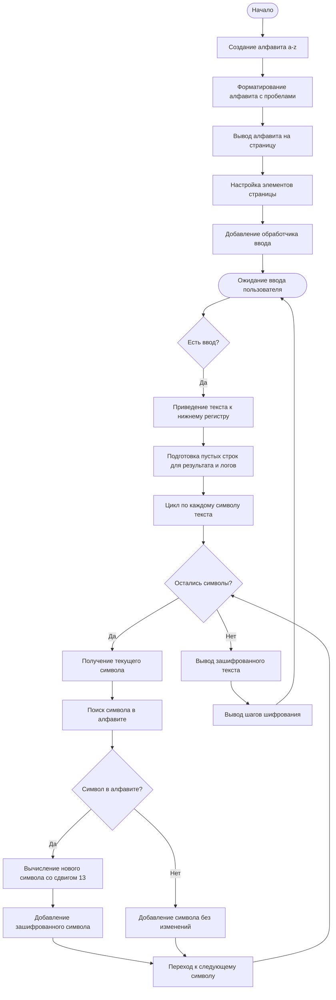

```mermaid
flowchart TD
    A([Начало]) --> B[Создание алфавита a-z]
    B --> C[Форматирование алфавита с пробелами]
    C --> D[Вывод алфавита на страницу]
    D --> E[Настройка элементов страницы]
    E --> F[Добавление обработчика ввода]
    
    F --> G([Ожидание ввода пользователя])
    
    G --> H{Есть ввод?}
    H --> |Да| I[Приведение текста к нижнему регистру]
    I --> J[Подготовка пустых строк для результата и логов]
    J --> K[Цикл по каждому символу текста]
    
    K --> L{Остались символы?}
    L --> |Да| M[Получение текущего символа]
    M --> N[Поиск символа в алфавите]
    N --> O{Символ в алфавите?}
    O --> |Нет| P[Добавление символа без изменений]
    O --> |Да| Q[Вычисление нового символа со сдвигом 13]
    Q --> R[Добавление зашифрованного символа]
    R --> S[Переход к следующему символу]
    P --> S
    S --> L
    
    L --> |Нет| T[Вывод зашифрованного текста]
    T --> U[Вывод шагов шифрования]
    U --> G
```